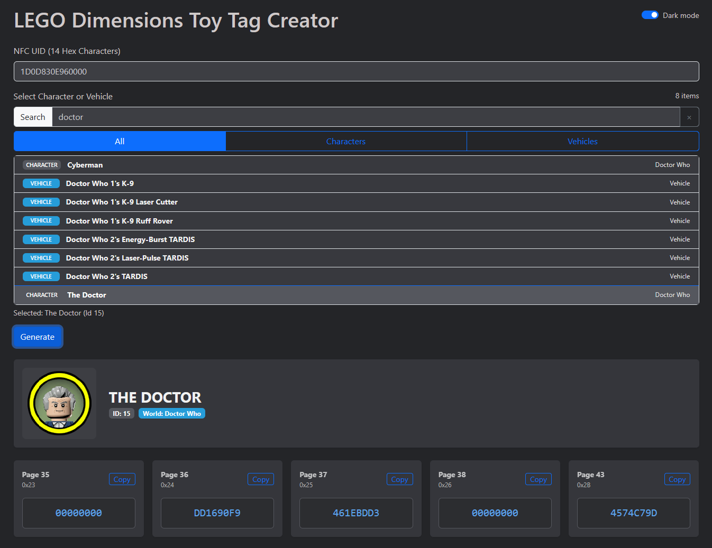
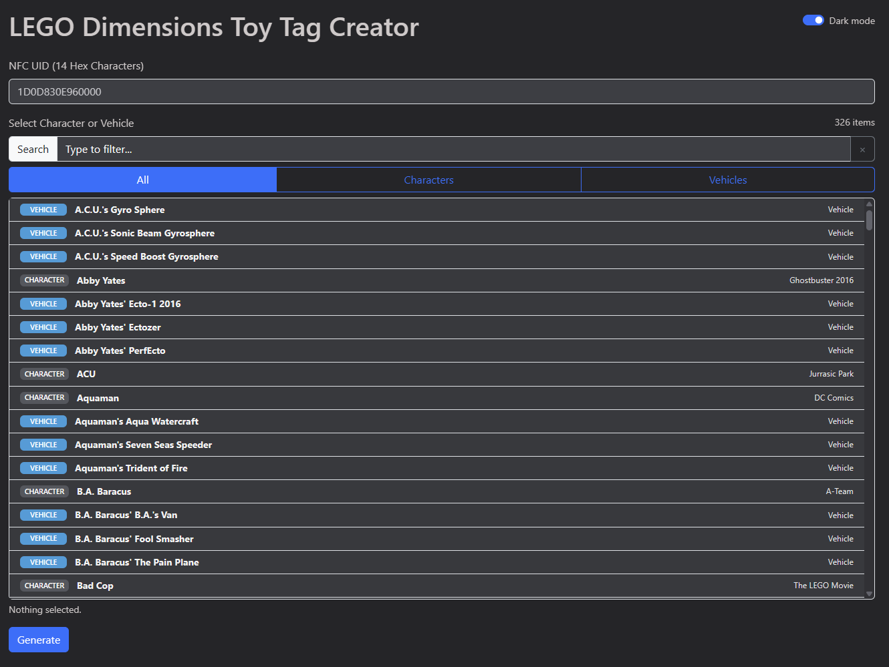
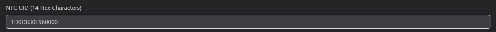
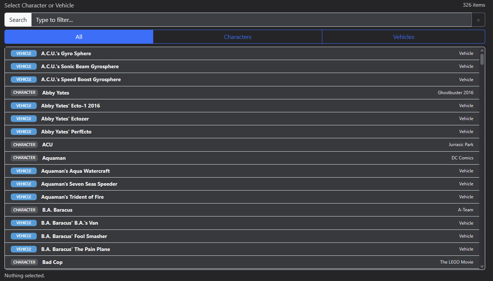
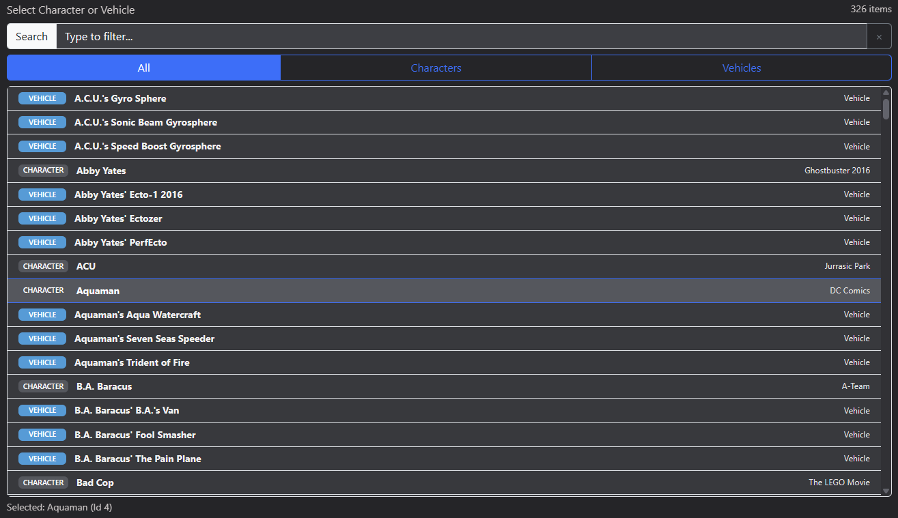
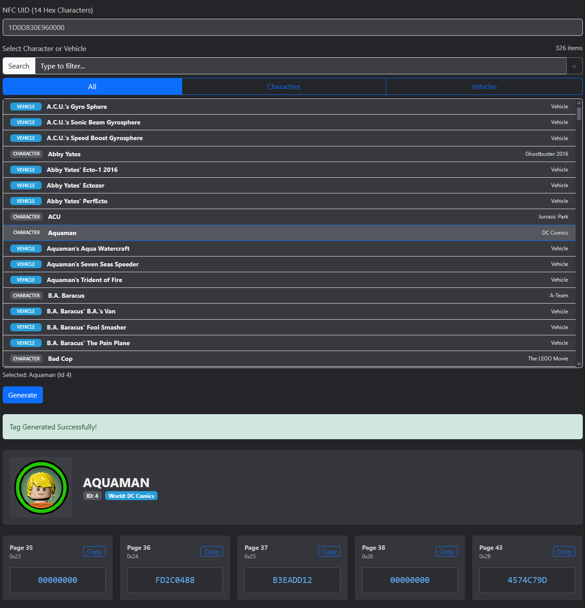
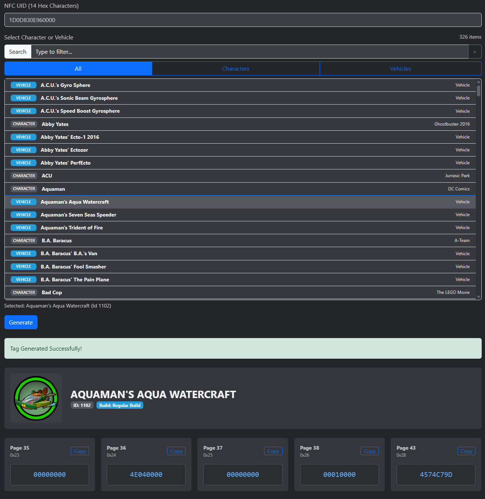
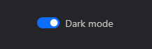
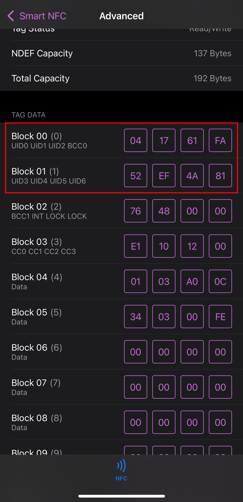
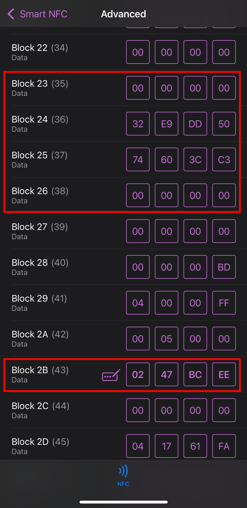

# Lego Dimensions NFC213 Tag Generator

<p align="center">
  <strong>Open-source web application for generating Lego Dimensions NFC tag codes</strong><br>
  Create custom character and vehicle tags for the discontinued Lego Dimensions game using NFC213 tags.
</p>

<p align="center">
  
  
  
  
  
  
</p>

---

## Table of Contents

- [Overview](#overview)
- [Features](#features)
- [Prerequisites](#prerequisites)
- [Installation and Running](#installation-and-running-the-web-application)
- [Using the Web Interface](#using-the-web-interface)
- [Reading Your NFC Tag UID](#step-1--reading-your-nfc213-tag-uid)
- [Writing to Your NFC Tag](#step-2--writing-to-your-nfc213-tag)
- [How It Works](#how-character-and-vehicle-tag-codes-work)
- [Character Mapping & Image Display](#character-mapping--image-display)
- [Credits](#credits)
- [Notes](#notes)
- [License](#license)

---

## Overview

This project is a **Node.js web application** that generates the required **HEX data** to program replacement Toy Tags for the game **Lego Dimensions** using **NFC213 tags**.  
The application takes the **UID from a blank NFC213 tag** and a **Character or Vehicle ID**, and produces the values that need to be written to the NFC tag so it can be used with the Lego Dimensions Toy Pad.

The web interface provides an easy-to-use, visual way to search for characters and vehicles, generate codes, and includes light/dark mode themes for comfortable viewing.

> ⚠️ This project is for educational purposes and to preserve access to Lego Dimensions, a game and hardware ecosystem no longer manufactured. You must supply your own NFC213 tags.

---

## Features

- **Complete Character & Vehicle Database** - All Lego Dimensions characters and vehicles with accurate IDs
- **Visual Icon Display** - Custom handmade icons with color-coded pack types (25mm coin capsule size)
- **Smart Search & Filter** - Quickly find characters or vehicles by name, or filter by type
- **Light/Dark Mode** - Toggle between themes for comfortable viewing
- **Responsive Design** - Works seamlessly on desktop and mobile devices
- **Accurate Encryption** - Generates proper cryptographic codes for NFC tags
- **Easy to Use** - Simple web interface, no command-line knowledge required
- **Self-Hosted** - Run locally on your own machine, no internet connection needed after setup
- 📖 **Open Source** - Full source code available for learning and customization

  
*Full page view of the web interface showing the UID input field, search box, character/vehicle list and selected character generated codes*

---

## Prerequisites
- Blank **NFC213 tags**  
- The [**Smart NFC**](https://apps.apple.com/us/app/smart-nfc/id1470146079) app (from the iOS App Store)  
- Node.js installed on your computer  
- A modern web browser (Chrome, Firefox, Edge, Safari)

---

## Installation and Running the Web Application

1. Clone or download this repository:
   ```bash
   git clone https://github.com/sys-MWell/lego-dimensions-nfc-writer.git
   cd lego-dimensions-nfc-writer
   ```

2. Install dependencies:
   ```bash
   npm install
   ```

3. Start the web server:
   ```bash
   npm start
   ```
   or
   ```bash
   node server.js
   ```

4. Open your web browser and navigate to:
   ```
   http://localhost:3000
   ```

5. The web interface will load and you can begin generating NFC tag codes!

> 💡 **Tip:** The server will run on port 3000 by default. Keep the terminal window open while using the application.

  
*Full page view of the web interface showing the UID input field, search box, and character/vehicle list*

---

## Using the Web Interface

The web interface provides a simple, intuitive way to generate NFC tag codes:

### Step 1: Enter Your NFC Tag UID

1. In the **UID input field** at the top of the page, enter your **14-character hexadecimal UID** (e.g., `1D0D830E960000`).
   - See the section below on how to obtain your UID using the Smart NFC app.

  
*Close-up of the UID input field with an example UID entered*

### Step 2: Search and Select a Character or Vehicle

2. Use the **search box** to find a character or vehicle by name.
   - Or use the **filter buttons** to view only Characters or only Vehicles.

  
*Search box with partial text and filter buttons (Characters/Vehicles) highlighted*

3. **Click on a character or vehicle name** from the list to select it.
   - The selection will be highlighted, but codes are not generated yet.

  
*A character selected from the list, showing the highlighted state*

### Step 3: Generate the Codes

4. Click the **"Generate" button** to generate the NFC tag codes.

### Step 4: View and Copy the Generated Codes

5. The results will appear below the button, showing:
   - **Character/Vehicle image and name**
   - **ID number**
   - **World** (for characters) or **Build type** (Regular, Build 1, Build 2 for vehicles)
   - **Five generated HEX codes** for lines 35, 36, 37, 38, and 43

  
*Full results display for a character showing image, name, world badge, and the 5 HEX code blocks*

  
*Full results display for a vehicle showing image, name, build type, and the 5 HEX code blocks*

6. **Copy each HEX code** and use them with the Smart NFC app to write to your NFC213 tag.

> 📝 **Note:** If you select a different character or vehicle after generating codes, you must click the **"Generate" button again** to regenerate the codes for the new selection.

### Theme Toggle

The interface includes a **light/dark mode toggle** in the top-right corner of the page. Click the button to switch between themes for comfortable viewing in any lighting condition.

  
*Web interface in dark mode showing the theme toggle button*

---

## Step 1 — Reading Your NFC213 Tag UID

To use this tool, you first need to obtain the UID from your blank NFC213 tag:

1. Install and open **Smart NFC** on your iPhone.  
2. Tap on **Advanced** and make sure the protocol is set to **ISO 14443**.  
   - If you don't do this, you may get an error that the tag does not contain an NDEF message.  
3. Scan your **blank NFC213 tag**.  
4. Scroll down to view the **lines/blocks**.  
   - Copy the first 6 characters of **line 1 (Block 00)** and all 8 characters of **line 2 (Block 01)**.  
   - Combine them into your UID.
   - Drop the last 2 characters from line 1.  
   - Example:  
     ```
     Line 1 (0x00): ABCDEF01
     Line 2 (0x01): 23456789
     UID = ABCDEF23456789
     ```

  
*Smart NFC app showing Block 00 and Block 01 with UID highlighted*

---

## Step 2 — Writing to Your NFC213 Tag

Once you have generated the codes using the web interface:

1. In the Smart NFC app, open the blank tag again.
2. Update only the following lines with the generated values:
   - Line 35 (0x23)
   - Line 36 (0x24)
   - Line 37 (0x25)
   - Line 38 (0x26)
   - Line 43 (0x2B)

  
*Smart NFC app showing a line being edited with generated HEX code*

3. Rules:
   - **Do not edit any other lines.**
   - Only update one block at a time.
   - After entering new data, tap **WRITE** and scan the tag again.
   - Repeat until all changes are written.

  
*Smart NFC app showing the WRITE button after entering HEX data*

4. Place the tag on the Lego Dimensions Toy Pad.
   - Your character/vehicle should appear in-game from the vortex!

  
*Photo of the written NFC tag on the Lego Dimensions Toy Pad with character appearing in-game*

---

## How Character and Vehicle Tag Codes Work

The data written to your tag determines whether it's a character or vehicle:
   - Line 35 (0x23): Always `00000000`
   - Lines 36–37: Based on Character/Vehicle ID
      - Characters: Derived from UID + Character ID → unique per tag
      - Vehicles:
         - Line 36 = based solely on Vehicle ID
         - Line 37 = always `00000000`
   - Line 38 (0x26): Identifies token type
      - Characters = `00000000`
      - Vehicles = `00010000`
   - Line 43 (0x2B): Based solely on UID

### Example — Vehicle (Bad Cop's Police Car, Vehicle ID 1000)
```
Line 35 (0x23): 00000000
Line 36 (0x24): E8030000
Line 37 (0x25): 00000000
Line 38 (0x26): 00010000
Line 43 (0x2B): [Generated from UID]
```

---

## Character Mapping & Image Display

This project includes a comprehensive visual database of all Lego Dimensions characters and vehicles with custom icon images.

### Character/Vehicle Database

The application uses JSON mapping files located in the `data/` folder:
- **charactermap.json** - Maps character IDs to names and metadata
- **vehiclesmap.json** - Maps vehicle IDs to names and build types (Regular, Build 1, Build 2)
- **iconimgmap.json** - Maps character/vehicle IDs to their corresponding icon images

### Icon Color Coding

The character and vehicle icons feature colored outer circles that indicate their original pack type:

- **🔵 Blue** - Starter Pack
- **🟢 Green** - Fun Pack
- **🟡 Yellow** - Level Pack
- **🟠 Orange** - Team Pack
- **🔴 Cyan/Red** - Polybag
- **🟣 Purple** - Story Pack

These icons are sized for 25mm coin capsules, making them perfect for creating custom physical tag labels.

  
*Examples of different pack types showing the color-coded outer circles*

---

## Credits

This project is built upon and inspired by community contributions:

### Code & Data
   - [**AlinaNova21**](https://github.com/AlinaNova21) — [**node-ld**](https://github.com/AlinaNova21/node-ld), the Node.js Lego Dimensions Library (provided the base code and character JSON list).
   - [**iroteta**](https://pastebin.com/u/iroteta) — Provided [**list_of_characters.json**](https://pastebin.com/YWkX6jaV) and [**list_of_vehicles.json**](https://pastebin.com/NHmWs6gb).

### Graphics & Images
   - [**Jeneric (u/cwbunks)**](https://www.reddit.com/user/cwbunks/) — Created the handmade icon sheet with all character and vehicle images (25mm coin capsule size). [Source thread](https://www.reddit.com/r/Legodimensions/comments/1kxmgzu/handmade_icons_for_every_character_and_vehicle_in/).
   - [**u/legoanimegirl**](https://www.reddit.com/user/legoanimegirl/) — Ripped character sprites from the LDWiki that were used in the icon creation.

### Community Resources & Tutorials
   - [**NFC cloning using iOS**](https://www.reddit.com/r/Legodimensions/comments/kq1dcv/nfc_cloning_using_ios/)
   - [**How to make NFC tags for Lego Dimensions**](https://www.reddit.com/r/Legodimensions/comments/1abb147/how_to_make_nfc_tags_for_lego_dimensions_pc_iphone/)
   - [**How to write Lego Dimensions NFC tags with MiFARE++ Ultralight**](https://www.reddit.com/r/Legodimensions/comments/jlk6ne/comment/gar9tak/?utm_source=reddit&utm_medium=web2x&context=3)
   - **Chteupnin's LD Project Discord** — Community-driven support and development.
      - [**Discord invite**](https://discord.gg/kzsVVYGrW3)
      - [**Chteupnin's LD Generation Website**](https://chteupnin.sp-it.be/)

---

## Notes
   - This project replicates the original functionality of the now-defunct **ldcharcrypto** website, but with additional features including a modern web interface, light/dark mode themes, and improved character/vehicle search and filtering.
     - ⚠️ **Warning:** The original ldcharcrypto website is now closed and has been reported as dangerous by browsers. Do not attempt to visit or use it.
   - The web application provides an intuitive interface for generating NFC tag codes without needing to use the command line.
   - This was a fun project to work on as a big fan of **LEGO Dimensions**. The goal is to preserve tag generation capabilities for the community and ensure this amazing game remains playable.
   - To the best of our knowledge, this might be the only public repository with working, open-source code that actually generates functional Lego Dimensions NFC tags. Feel free to explore, learn from, and contribute to this project!

---

## License

This project is for educational and preservation purposes only. Lego Dimensions is a trademark of The LEGO Group and Warner Bros. Interactive Entertainment.
